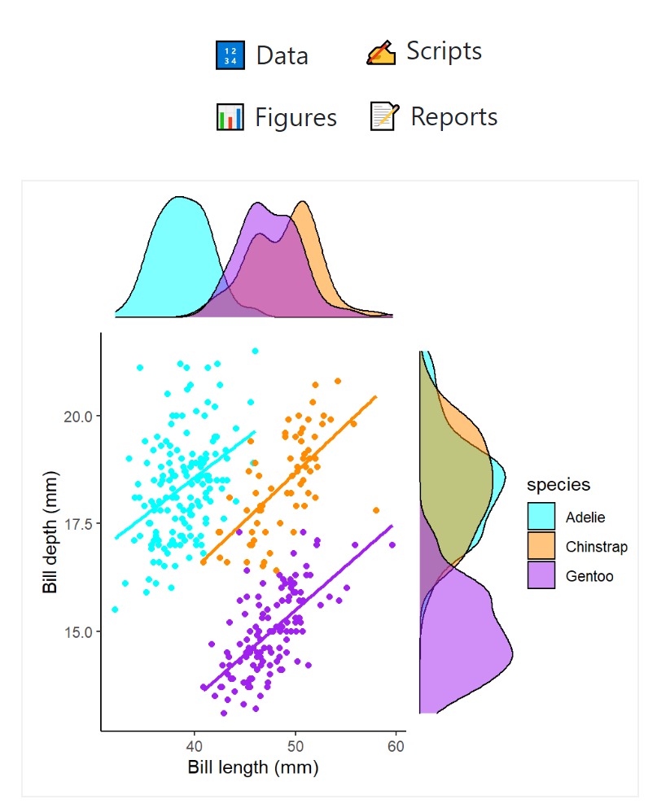

::: {.page-intro}
I am an [Associate Professor in Genetics & Data Science](https://research-portal.uea.ac.uk/en/persons/philip-leftwich) in the School of Biological Sciences at the University of East Anglia. My work connects insect genetics, microbiomes, synthetic biology, and computational teaching across research and higher education.
:::

::: {.section-panel}
## Overview

My research is based in molecular genetics and evolutionary biology, with a particular focus on developing and testing genetic technologies for pest control. I am especially interested in gene drive systems, transgene expression, and the evolutionary and practical questions that shape applied genetic pest management.

Alongside this work, I develop teaching in genetics, genomics, statistics, and data science. That teaching emphasis feeds back into the lab's broader interest in clear computational practice, open resources, and accessible training.
:::

## Research areas

::: {#research-areas}
:::

## Teaching

::: {.page-intro}
I teach across undergraduate and postgraduate modules in biological sciences, with a strong focus on genetics, genomics, molecular biology, and data science.
:::

::: {.section-grid}

  Teaching
  
  <h3>Data Science</h3>
  
5023Y · University of East Anglia

  Teaching
  
  <h3>Genetics</h3>
  
5011 · University of East Anglia

  Teaching
  
  <h3>Molecular Biology & Genetics</h3>
  
4018A · University of East Anglia

  Teaching
  <h3>Microbiology</h3>
  
5015 · University of East Anglia

  Teaching
  <h3>Genomics</h3>
  
6013A · University of East Anglia

  Teaching
  
  <h3>Field Ecology</h3>
  
5013 · University of East Anglia

:::

## CV

::: {.section-panel}
A full copy of my CV is available [on GitHub](https://github.com/Philip-Leftwich/PL_CV/blob/master/Philip_Leftwich_CV.pdf).
:::
