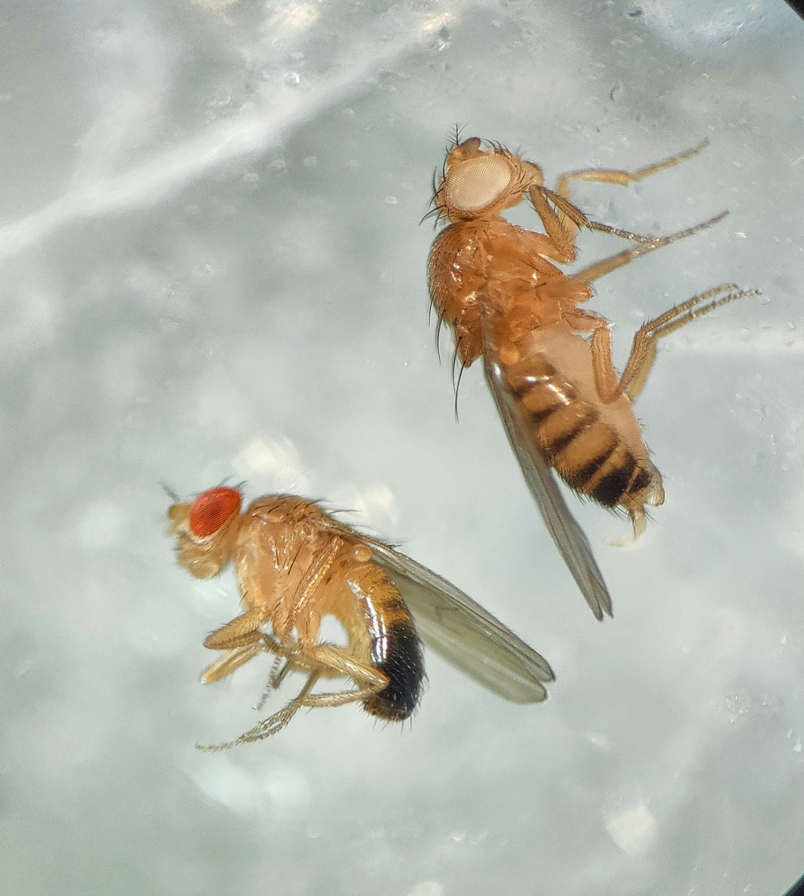
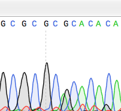

::: {.home-hero}
::: {.home-hero__content}

::: {.home-eyebrow}
Genetics · genetic pest management · microbiomes
:::

# Philip Leftwich

I am an Associate Professor in Genetics & Data Science at the University of East Anglia. My work combines insect genetics, microbiomes, synthetic biology, and computational teaching to study and apply genetic technologies in agriculture, public health, and higher education.

::: {.home-quicklinks}
<a class="pill-link" href="about.html">Explore research</a>
<a class="pill-link pill-link--ghost" href="people.html">Meet the group</a>
<a class="pill-link pill-link--ghost" href="publications.html">View publications</a>
:::

:::

  
  
  
  

:::

::: {.page-intro}
This site brings together research, people, publications, teaching, and open resources connected to my work in molecular biology, genetics, data science, and outreach.
:::

::: {.section-grid}

  Research
  <h3>Gene drives, microbiomes, and insect genetics</h3>
  
Find current research themes, teaching interests, and project summaries across pest management and symbiosis.

  <a class="feature-card__link" href="about.html">Read more →</a>

  People
  <h3>Current and past group members</h3>
  
Meet students, collaborators, and recent members connected to the group at the University of East Anglia.

  <a class="feature-card__link" href="people.html">View people →</a>

  Publications
  <h3>Recent papers and preprints</h3>
  
Browse publications covering synthetic biology, quantitative genetics, microbiomes, and teaching-focused scholarship.

  <a class="feature-card__link" href="publications.html">Browse publications →</a>

  Resources
  <h3>Teaching materials and workshops</h3>
  
Explore workshops, authored resources, and recommended links for genetics, statistics, and data science teaching.

  <a class="feature-card__link" href="resources.html">Explore resources →</a>

:::

## Latest news

::: {.page-intro}
Recent writing and updates from the site.
:::

::: {#latest-news}
:::

## Teaching & resources

::: {.section-panel}
Across undergraduate teaching, invited workshops, and open educational resources, I share practical materials for genetics, molecular biology, statistics, and data science.

::: {.home-quicklinks}
<a class="pill-link pill-link--ghost" href="talks_workshops.html">Talks & workshops</a>
<a class="pill-link pill-link--ghost" href="myresources.html">Books & teaching resources</a>
<a class="pill-link pill-link--ghost" href="resources.html">Recommended links</a>
:::
:::
