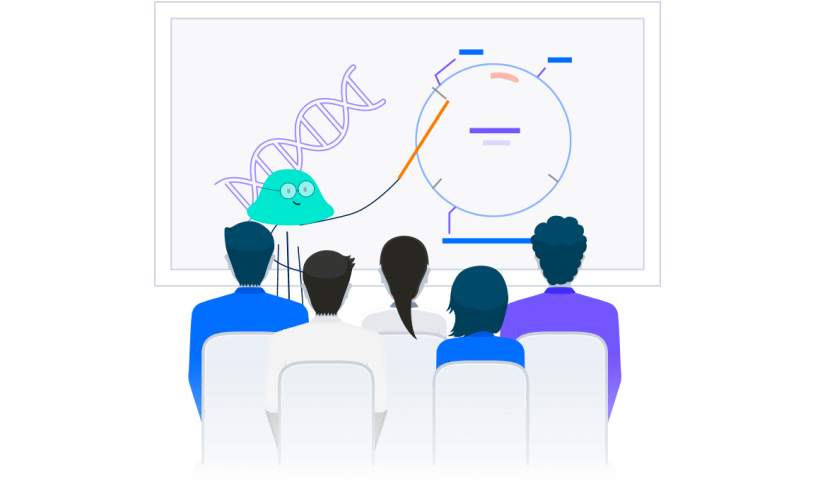
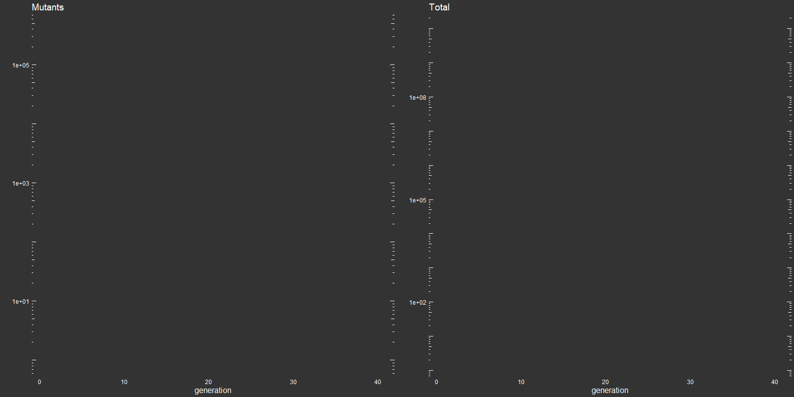

::: {.page-intro}
A selection of my authored resources, educational collaborations, and teaching-focused projects in genetics, molecular biology, and data science.
:::

## Books

::: {.section-grid}

  
  Book
  <h3>Maths skills for A-level Biology</h3>
  
Oxford University Press.

  <a class="feature-card__link" href="https://amzn.eu/d/bKpjHn9">View book →</a>

:::

## Communities

::: {.section-panel}
### [Biosciences Teaching and Education Research Zenodo Page](https://zenodo.org/communities/uea-bio-teaching)
A curated collection of talks, workshops, and teaching innovations from the School of Biological Sciences at the University of East Anglia.

### [R-volutionary Biology](https://ueabio.github.io/Rvolutionary-Biology/)
A landing page for R and data science education activities based in the School of Biological Sciences at UEA.

### [Skills Community of Practice](https://www.skillscop.com/)
An informal forum for sharing approaches to teaching undergraduate skills across disciplines and institutions.
:::

## Genetics & molecular biology

::: {.section-grid}

  
  Educational collaboration
  <h3>Benchling for distance learning</h3>
  
Free-to-use lessons for teaching genetics and molecular biology, developed with Benchling.

  <a class="feature-card__link" href="https://www.benchling.com/educators">View lessons →</a>

  
  Open teaching tool
  <h3>Simulations of bacterial mutation</h3>
  
Interactive materials for teaching fundamental concepts of mutation in genetics.

  <a class="feature-card__link" href="https://github.com/Philip-Leftwich/Luria_Delbruck">Open project →</a>

:::
