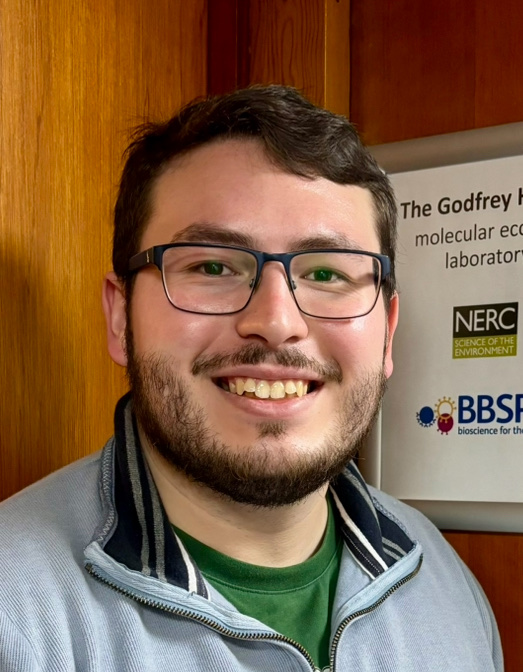
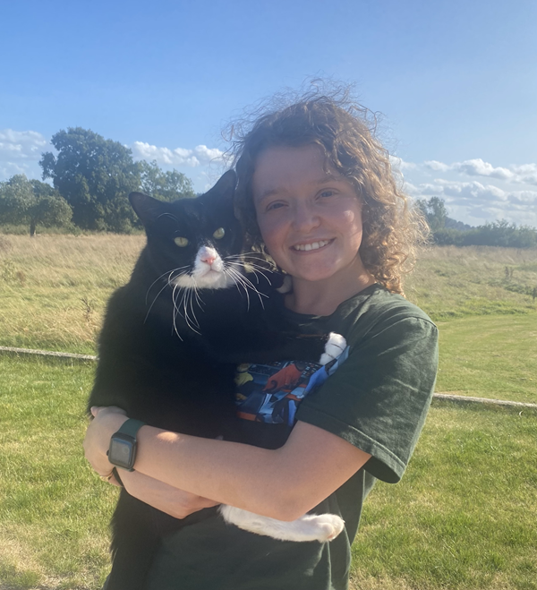
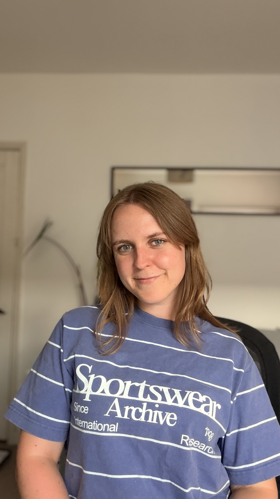
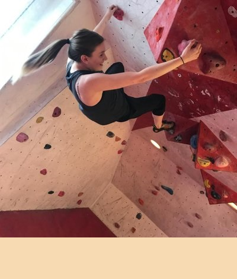
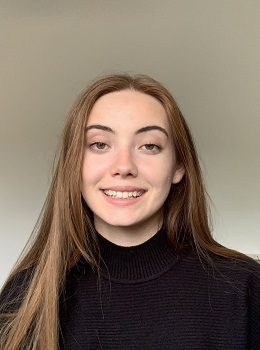

::: {.page-intro}
The group brings together research and teaching interests in genetics, molecular biology, and data science at the University of East Anglia.
:::

## Current members {#sec-curr}

::: {.profile-grid}

<article class="profile-card" id="philip-leftwich">
  
  
Associate Professor · University of East Anglia

  <h3>Dr Philip Leftwich</h3>
  
Molecular biologist working on genetic pest management, insect genetics, microbiomes, and computational teaching.

  
<a href="https://research-portal.uea.ac.uk/en/persons/philip-leftwich">UEA profile</a> · <a href="https://orcid.org/0000-0001-9500-6592">ORCID</a> · <a href="https://github.com/philip-leftwich">GitHub</a> · <a href="https://bsky.app/profile/philipleftwich.bsky.social">Bluesky</a> · <a href="mailto:p.leftwich@uea.ac.uk">Email</a>

</article>

<article class="profile-card" id="matthew-shackleton-chavez">
  
  
PhD Student · University of East Anglia

  <h3>Matthew Shackleton-Chavez</h3>
  
Doctoral researcher contributing to the improvement of gene drives in pest insects.

  
<a href="https://www.linkedin.com/in/samuel-matthew-s-5698131ba/">LinkedIn</a> · <a href="mailto:s.shackleton-chavez@uea.ac.uk">Email</a>

</article>

<article class="profile-card" id="katie-millar">
  
  
PhD Student · University of East Anglia

  <h3>Katie Millar</h3>
  
Doctoral researcher working at the interface microbiomes and applied pest management.

  
<a href="https://bsky.app/profile/katiemillar.bsky.social">Bluesky</a> · <a href="https://www.linkedin.com/in/katie-millar-15bb56236">LinkedIn</a> · <a href="mailto:katie.millar@uea.ac.uk">Email</a>

</article>

<article class="profile-card" id="amber-hall">
  
  
PhD Student · University of East Anglia

  <h3>Amber Hall</h3>
  
Doctoral researcher working on the applications of the sex determination pathways in pest insects.

  
<a href="https://bsky.app/profile/amberhall.bsky.social">Bluesky</a> · <a href="https://www.linkedin.com/in/amber-hall-622bb7206">LinkedIn</a> · <a href="mailto:amber.hall@uea.ac.uk">Email</a>

</article>

<article class="profile-card" id="J-C">
  
  
BBSRC funded Senior Postdoctoral Research Associate · University of East Anglia

  <h3>Jean Charles de Coriolis</h3>
  
 Single nuclei transcriptomics of the Mediterranean fruit fly

  
 <a href="mailto:J.De-Coriolis@uea.ac.uk">Email</a>

</article>

:::

## Past members {#sec-past}

::: {.profile-grid}
<article class="profile-card" id="alex-siddall">
  
  
PhD Student

  <h3>Alex Siddall</h3>
  
<strong>Project:</strong> Genetic control in medfly.

  
<a href="https://twitter.com/alx_sdd">Twitter</a> · <a href="mailto:a.siddall@uea.ac.uk">Email</a>

</article>

<article class="profile-card" id="joerel-gestopa">
  
  
MSc Student

  <h3>Joerel Gestopa</h3>
  
<strong>Project:</strong> Life-history fitness in transgenic medfly.

</article>

<article class="profile-card" id="amy-butler">
  
  
UG Student

  <h3>Amy Butler</h3>
  
<strong>Project:</strong> Parental effects on the offspring metabolome in medfly.

</article>

<article class="profile-card" id="jacob-rose">
  
  
MSc Student

  <h3>Jacob Rose</h3>
  
<strong>Project:</strong> Developing Cas9 transgenics in the red flour beetle.

</article>

:::